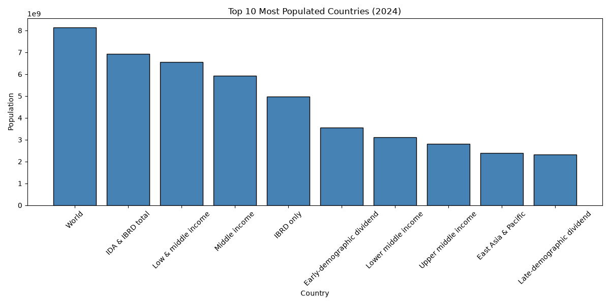
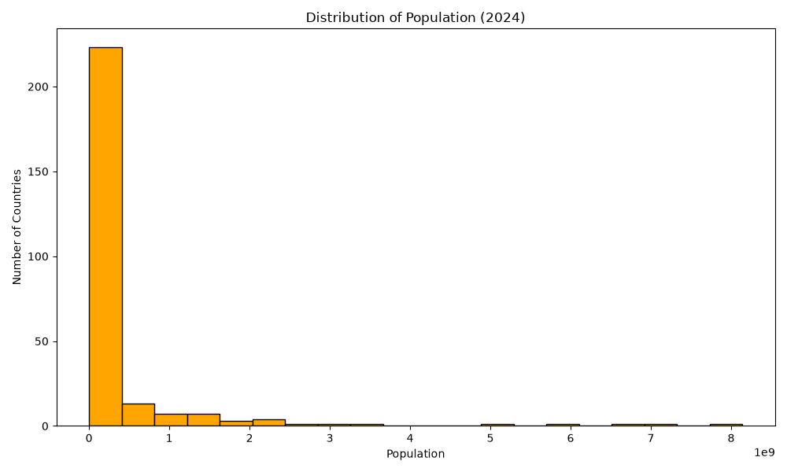

# Prodigy InfoTech Data Science Internship - Task 1

## Objective
Create a bar chart and histogram to visualize the distribution of a continuous variable (population) using the World Bank Population dataset.

## Dataset
- Dataset: World Bank Population Dataset
- File: `API_SP.POP.TOTL_DS2_en_csv_v2_38144.csv`

## Tools & Libraries
- Python
- Pandas
- Matplotlib
- Visual Studio Code

## Steps Performed
1. Imported the required libraries.
2. Loaded the CSV dataset using Pandas.
3. Skipped metadata rows using `skiprows=4`.
4. Removed the empty column (`Unnamed: 69`).
5. Selected the Country Name and 2024 population columns.
6. Removed missing values.
7. Sorted the data by population.
8. Selected the Top 10 most populated countries.
9. Created a Bar Chart.
10. Created a Histogram showing the population distribution.

## Output
### Bar Chart
Displays the Top 10 Most Populated Countries (2024).

### Histogram
Shows the distribution of population across countries.

## Project Structure

```
task_01/
│── API_SP.POP.TOTL_DS2_en_csv_v2_38144.csv
│── task01.py
│── README.md
│── bar_chart.png
└── histogram.png
```

## Screenshots

### Bar Chart



### Histogram



## Author

Sarita