# Prodigy InfoTech Data Science Internship - Task 02

## Objective
Perform Data Cleaning and Exploratory Data Analysis (EDA) on the Titanic dataset to identify patterns, relationships, and factors affecting passenger survival.

## Dataset
- Dataset: Titanic Dataset
- File: `train.csv`

## Tools & Libraries
- Python
- Pandas
- Matplotlib
- Seaborn
- Visual Studio Code

## Steps Performed
1. Imported the required libraries.
2. Loaded the Titanic dataset using Pandas.
3. Displayed the first five rows and dataset information.
4. Generated descriptive statistics.
5. Checked for missing values.
6. Filled missing values in the **Age** column using the median.
7. Filled missing values in the **Embarked** column using the mode.
8. Dropped the **Cabin** column due to excessive missing values.
9. Performed Exploratory Data Analysis (EDA).
10. Created various visualizations to analyze passenger survival and feature relationships.

## Output

### Survival Count
Displays the number of passengers who survived and did not survive.

### Gender Distribution
Shows the distribution of male and female passengers.

### Survival by Gender
Compares survival rates based on gender.

### Passenger Class Distribution
Displays the number of passengers in each passenger class.

### Survival by Passenger Class
Shows survival distribution across passenger classes.

### Age Distribution
Illustrates the distribution of passengers' ages.

### Fare Distribution
Displays the distribution of ticket fares.

### Correlation Heatmap
Shows the correlation between numerical features.

### Age vs Survival
Compares passenger age with survival status.

### Fare by Passenger Class
Displays fare distribution across passenger classes.

### Pair Plot
Visualizes relationships among Age, Fare, Passenger Class, and Survival.

## Project Structure

```text
task_02/
│── train.csv
│── task02.py
│── README.md
│── survival_count.png
│── gender_distribution.png
│── survival_by_gender.png
│── passenger_class.png
│── survival_by_class.png
│── age_distribution.png
│── fare_distribution.png
│── correlation_heatmap.png
│── age_vs_survival.png
│── fare_by_class.png
└── pairplot.png
```

## Screenshots

### Survival Count

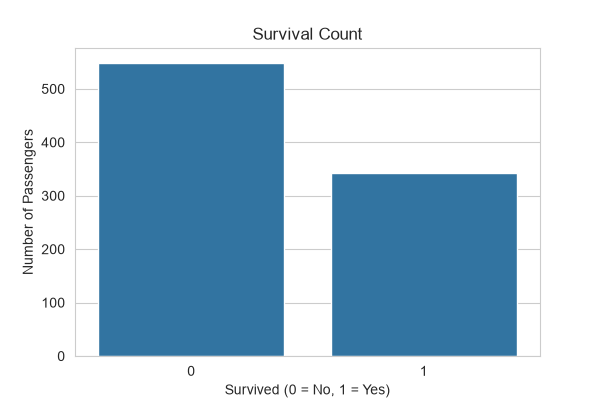

### Gender Distribution

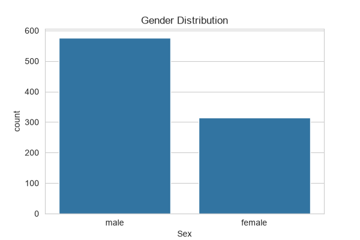

### Survival by Gender

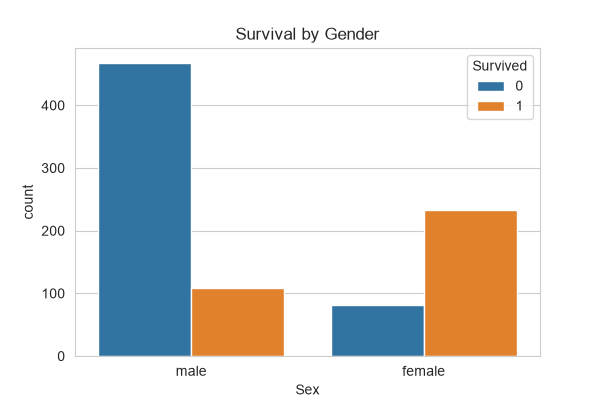

### Passenger Class Distribution

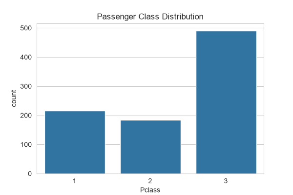

### Survival by Passenger Class

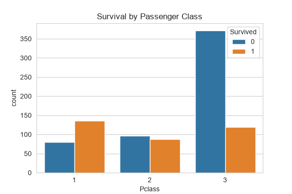

### Age Distribution

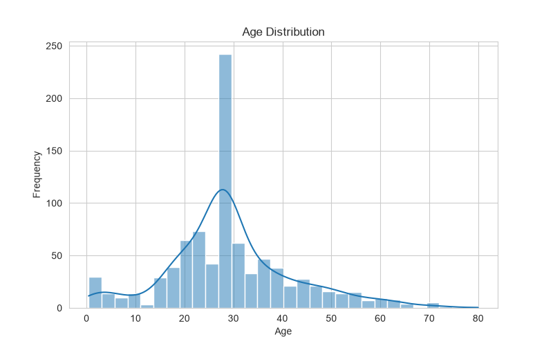

### Fare Distribution

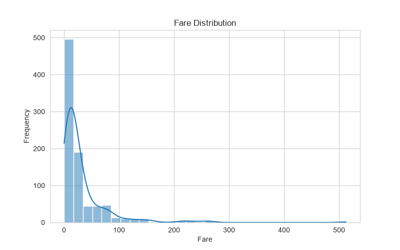

### Correlation Heatmap

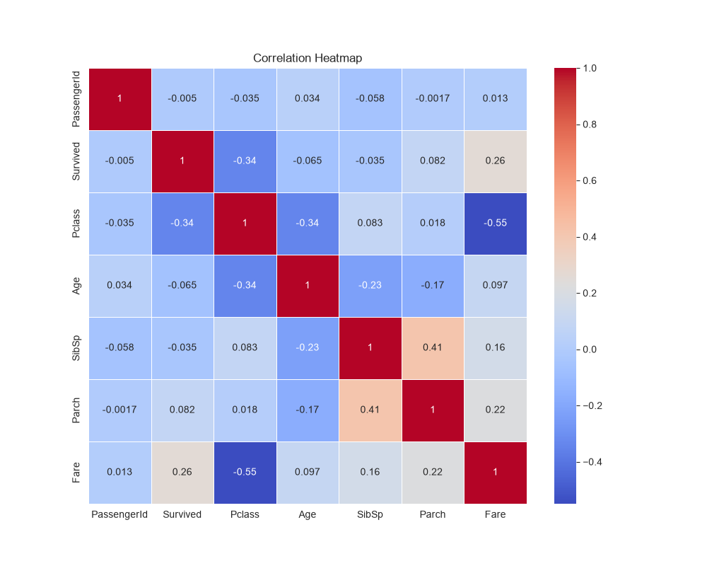

### Age vs Survival

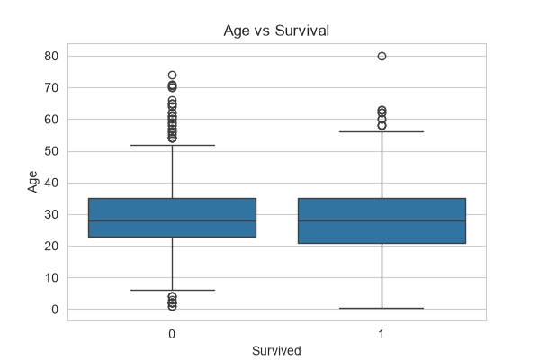

### Fare by Passenger Class

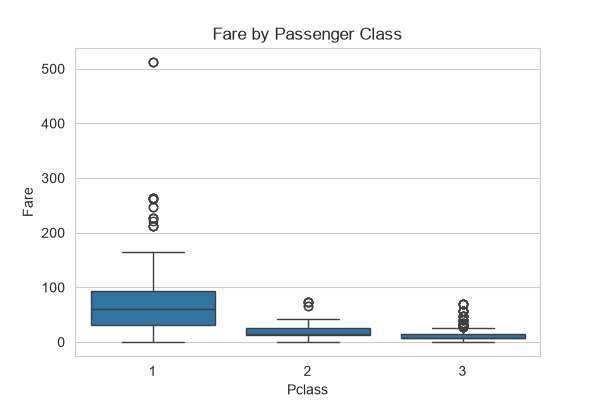

### Pair Plot

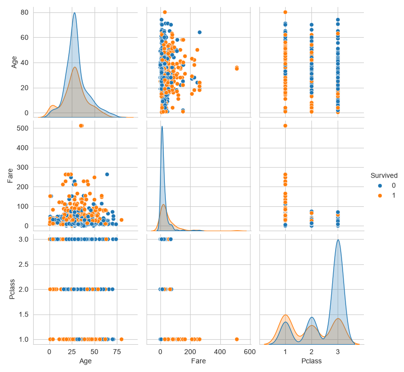

## Key Findings

- Female passengers had a higher survival rate than males.
- First-class passengers were more likely to survive.
- Most passengers were between 20–40 years old.
- Higher fare passengers generally had better survival chances.
- Missing values were successfully handled using median and mode imputation.

## Author

Sarita
