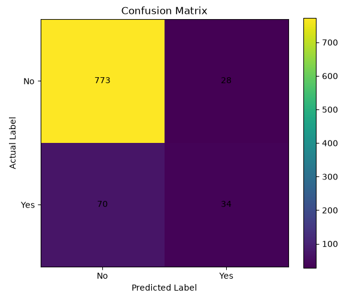
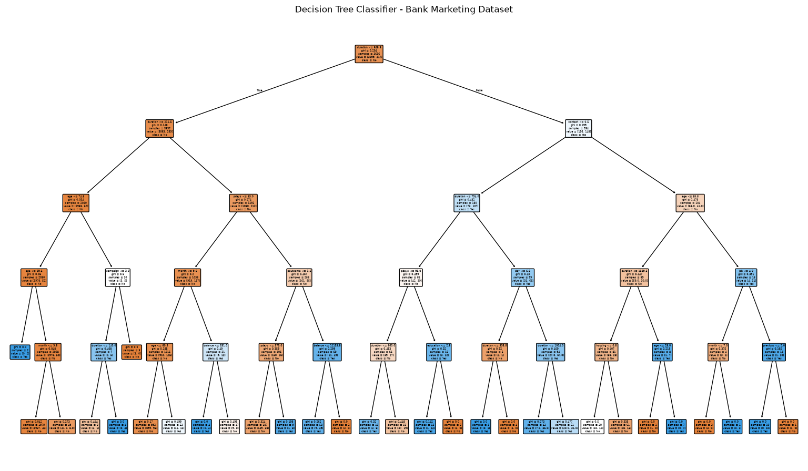

# Prodigy InfoTech Data Science Internship - Task 03

## Objective
Build a Decision Tree Classifier to predict whether a customer will purchase a product or service based on their demographic and behavioral data.

## Dataset
- Dataset: Bank Marketing Dataset
- File: `bank.csv`

## Tools & Libraries
- Python
- Pandas
- Matplotlib
- Scikit-learn
- Visual Studio Code

## Steps Performed
1. Imported the required libraries.
2. Loaded the Bank Marketing dataset using Pandas.
3. Displayed the first five rows and dataset information.
4. Generated descriptive statistics.
5. Checked for missing values.
6. Checked for duplicate rows.
7. Removed duplicate rows from the dataset.
8. Converted categorical variables into numerical values using Label Encoding.
9. Separated the dataset into features (`X`) and target variable (`y`).
10. Split the dataset into training and testing sets.
11. Created a Decision Tree Classifier.
12. Trained the model using the training data.
13. Made predictions using the trained model.
14. Calculated the model accuracy.
15. Generated a classification report.
16. Generated a confusion matrix.
17. Visualized the confusion matrix.
18. Visualized the trained Decision Tree.

## Output

### Dataset Information
Displays the first five rows, dataset shape, column names, and statistical information of the Bank Marketing dataset.

### Missing Values
Checks the dataset for missing values before performing the machine learning process.

### Duplicate Rows
Identifies duplicate records and removes them from the dataset.

### Data Encoding
Converts categorical variables into numerical values using Label Encoding to prepare the data for machine learning.

### Training and Testing Data
Splits the dataset into training and testing sets, using 80% of the data for training and 20% for testing.

### Decision Tree Classifier
Builds and trains a Decision Tree Classifier to predict whether a customer subscribed to the product or service.

### Model Accuracy
Displays the accuracy of the Decision Tree Classifier on the testing dataset.

### Classification Report
Provides the precision, recall, F1-score, and support of the classification model.

### Confusion Matrix
Displays the correct and incorrect predictions made by the Decision Tree Classifier.

### Decision Tree
Visualizes the structure of the trained Decision Tree Classifier.

## Project Structure

```text
task_03/
│── bank.csv
│── task_03.py
│── README.md
│── confusion_matrix.png
└── decision_tree.png
```

 ## Screenshots

 ### Confusion Matrix

 

 ### Decision Tree

 

 ## Key Findings

 - The Bank Marketing dataset was successfully cleaned and prepared for machine learning.
 - Duplicate rows were identified and removed.
 - Categorical variables were successfully converted into numerical values using Label Encoding.
 - The dataset was divided into training and testing sets.
 - A Decision Tree Classifier was successfully trained to predict customer subscription.
 - The model was evaluated using accuracy score, classification report, and confusion matrix.
 - The Decision Tree visualization shows the structure and decision-making process of the trained model.

## Author

Sarita
