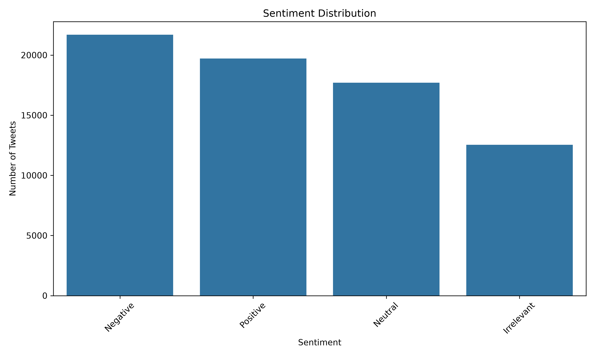
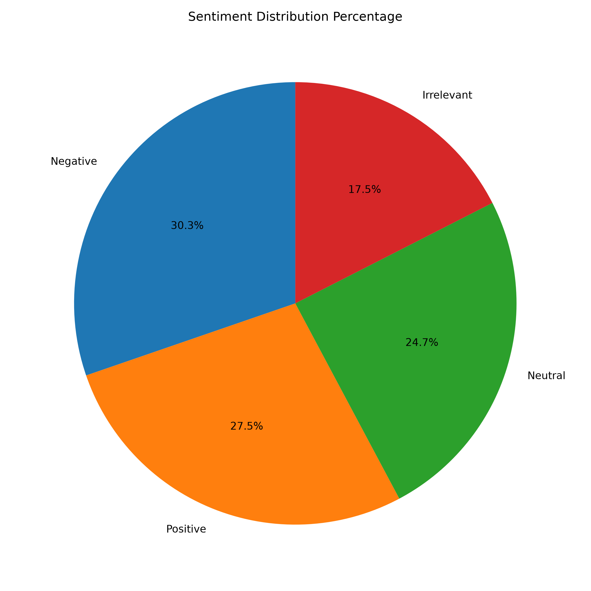
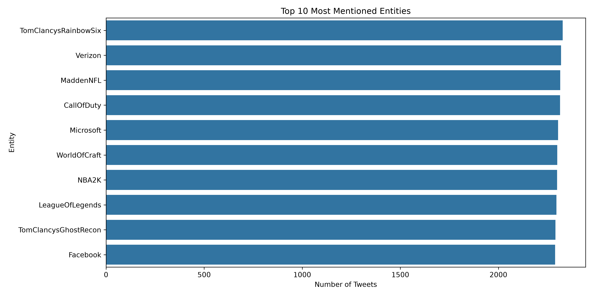
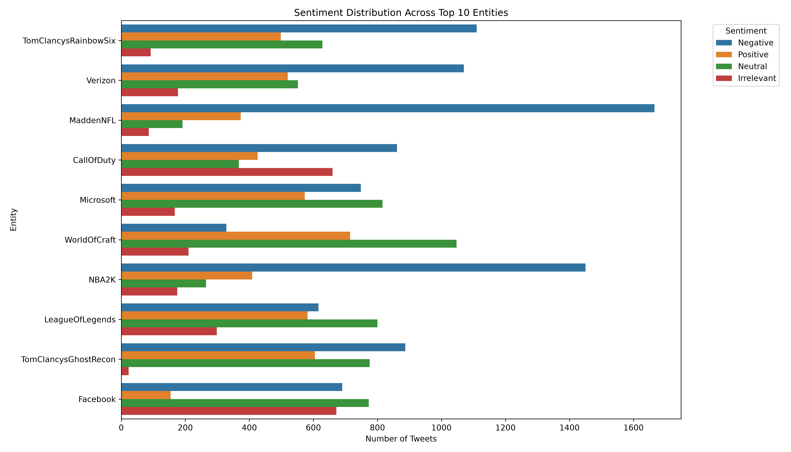
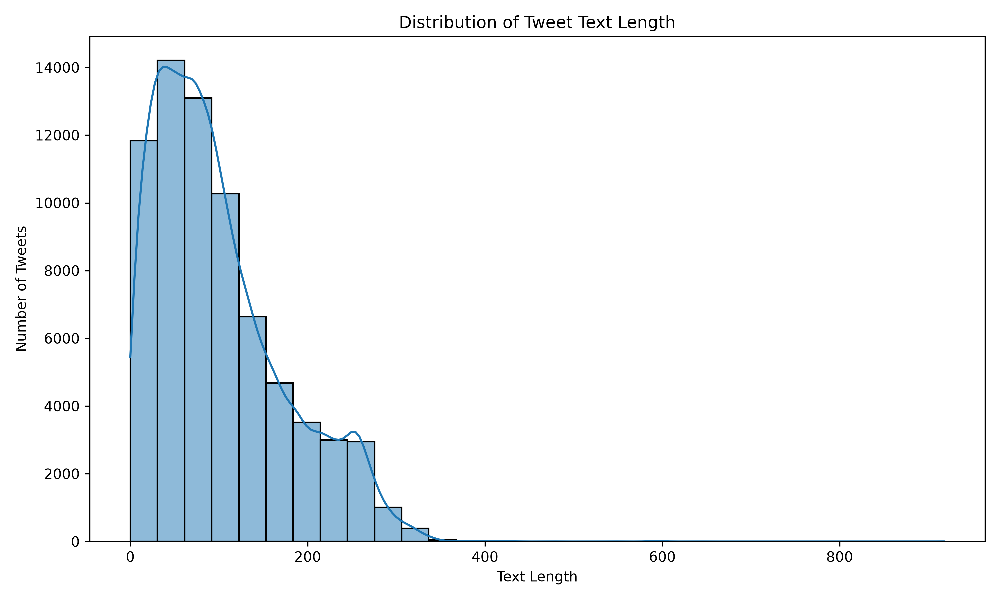
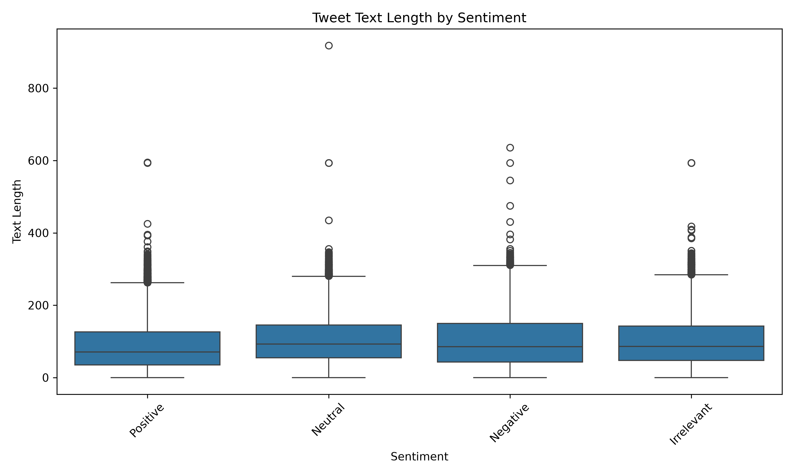
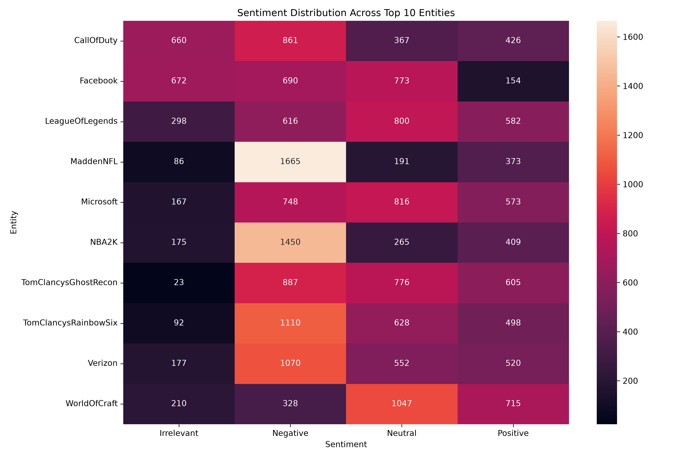

# Prodigy InfoTech Data Science Internship - Task 04

## Objective
Analyze and visualize sentiment patterns in social media data to understand public opinion and attitudes towards specific topics or brands.

## Dataset
- Dataset: Twitter Entity Sentiment Analysis Dataset
- File: `twitter_training.csv`

## Tools & Libraries
- Python
- Pandas
- Matplotlib
- Seaborn
- Regular Expressions (re)
- Visual Studio Code

## Steps Performed
1. Imported the required libraries.
2. Created an output folder to store generated visualizations and processed data.
3. Loaded the Twitter Entity Sentiment Analysis dataset using Pandas.
4. Displayed the first five rows of the dataset.
5. Checked the dataset shape and column names.
6. Renamed the dataset columns for better readability.
7. Displayed dataset information and statistics.
8. Checked for missing values.
9. Removed rows containing missing values.
10. Checked for duplicate rows.
11. Removed duplicate rows from the dataset.
12. Cleaned the social media text data.
13. Converted text data into lowercase.
14. Removed URLs, mentions, hashtags, special characters, and extra spaces.
15. Analyzed the unique sentiment categories in the dataset.
16. Analyzed the distribution of different sentiment categories.
17. Visualized the sentiment distribution using a count plot.
18. Visualized the percentage distribution of sentiments using a pie chart.
19. Identified the top 10 most frequently mentioned entities.
20. Visualized the top 10 entities using a bar chart.
21. Analyzed sentiment distribution across the top 10 entities.
22. Visualized sentiment distribution by entity.
23. Calculated the length of cleaned social media text.
24. Analyzed the distribution of tweet text lengths.
25. Visualized text length distribution using a histogram.
26. Compared tweet text length across different sentiment categories using a box plot.
27. Created a sentiment-entity cross-tabulation.
28. Visualized the relationship between entities and sentiments using a heatmap.
29. Saved all generated visualizations inside the `outputs` folder.
30. Saved the cleaned dataset as `cleaned_twitter_data.csv`.

## Output

### Dataset Information
Displays the first five rows, dataset shape, column names, and information about the Twitter Entity Sentiment Analysis dataset.

### Missing Values
Checks the dataset for missing values before performing data cleaning and analysis.

### Duplicate Rows
Identifies duplicate records and removes them from the dataset.

### Text Data Cleaning
Cleans the social media text by converting text to lowercase and removing URLs, mentions, hashtags, special characters, and unnecessary spaces.

### Sentiment Distribution
Analyzes the number of social media posts belonging to each sentiment category and visualizes the distribution using a count plot.

### Sentiment Percentage
Displays the percentage distribution of different sentiment categories using a pie chart.

### Top 10 Entities
Identifies and visualizes the 10 most frequently mentioned entities in the social media dataset.

### Sentiment by Entity
Analyzes how different sentiment categories are distributed across the most frequently mentioned entities.

### Text Length Distribution
Calculates and visualizes the distribution of social media post text lengths using a histogram.

### Text Length by Sentiment
Compares the length of social media posts across different sentiment categories using a box plot.

### Sentiment-Entity Heatmap
Visualizes the relationship between entities and sentiment categories using a heatmap.

### Cleaned Dataset
Saves the cleaned and processed dataset as `cleaned_twitter_data.csv` for further analysis.

## Project Structure

```text
task_04/
│── twitter_training.csv
│── task_04.py
│── README.md
│── sentiment_distribution.png
│── sentiment_pie_chart.png
│── top_10_entities.png
│── sentiment_by_entity.png
│── text_length_distribution.png
│── text_length_by_sentiment.png
│── sentiment_entity_heatmap.png
└── cleaned_twitter_data.csv
```

## Screenshots

### Sentiment Distribution



### Sentiment Pie Chart



### Top 10 Entities



### Sentiment By Entity



### Text Length Distribution



### Text Length By Sentiment



### Sentiment Entity Heatmap



## Key Findings

- The Twitter Entity Sentiment Analysis dataset was successfully loaded and cleaned.
- Missing values and duplicate records were identified and handled.
- Social media text data was cleaned by removing URLs, mentions, hashtags, special characters, and unnecessary spaces.
- The distribution of different sentiment categories was analyzed and visualized.
- The most frequently mentioned entities were identified from the dataset.
- Sentiment patterns across the top 10 entities were analyzed.
- The distribution of social media post text lengths was visualized.
- Text length was compared across different sentiment categories.
- A heatmap was created to visualize the relationship between entities and sentiment categories.
- The cleaned dataset and all generated visualizations were saved for further analysis.

## Author

Sarita
